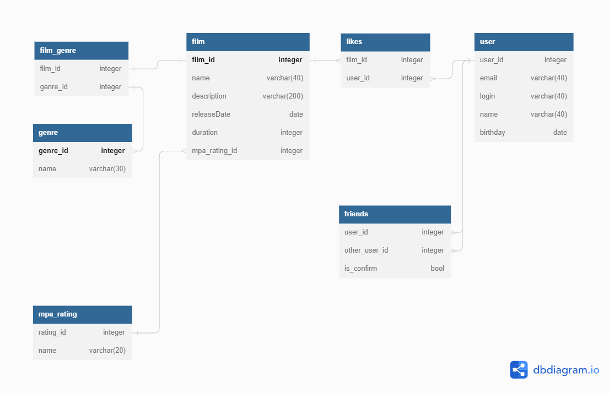

# java-filmorate
Template repository for Filmorate project.

## Описание БД:

### films
Содержит информацию о фильмах.
- первичный ключ **film_id** — идентификатор фильма;
- **name** - название фильма;
- **description** - описание фильма;
- **release_date** - дата выхода фильма;
- **duration** - длительность фильма;
- внешний ключ **mpa_rating_id** (ссылается на таблицу **mpa_rating**) — идентификатор рейтинга.

### mpa_rating
Содержит информацию о рейтингах кино.
- первичный ключ **id** — идентификатор рейтинга;
- **name** - название рейтинга.

### genre
Содержит информацию о жанрах кино.
- первичный ключ **genre_id** — идентификатор жанра;
- **name** — название жанра.

### film_genre
Содержит информацию о том какие фильмы к каким жанрам относятся.
-внешний ключ **film_id** (отсылает к таблице **film**) — идентификатор фильма;
-внешний ключ **genre_id** (отсылает к таблице **genre**) — идентификатор жанра.

### user
Содержит информацию о пользователях.
- первичный ключ **user_id** — идентификатор пользователя;
- **login** - логин пользователя;
- **name** - имя пользователя;
- **email** - электронная почта;
- **birthday** - день рождения.

### friends
Содержит информацию, какие пользователи являются друзьями.
- внешний ключ **user_id** (отсылает к таблице **user**) — идентификатор пользователя;
- внешний ключ **friend_id** (отсылает к таблице **user**) — идентификатор друга.

### likes
Содержит информацию об отметках "мне нравится".
- внешний ключ **film_id** (отсылает к таблице **film**) — идентификатор фильма;
- внешний ключ **user_id** (отсылает к таблице **user**) — идентификатор пользователя.

## Примеры запросов:

**Добавить фильм**

INSERT INTO films (name, description, release_date, duration, rating_id)   
VALUES (name, description, 2020.10.11, 120, 3)

**Обновить фильм c id = 1**

UPDATE films  
SET name = new_name,description = new_description, release_date = 2020.12.12, duration = 160, rating_id = 2  
WHERE id = 1;

**Удалить фильм c id = 1**

DELETE FROM films  
WHERE id = 1;

**Список всех жанров**

SELECT *
FROM genres  
ORDER BY id;

**Получить жанр c id = 1**

SELECT *
FROM genres  
WHERE id=1;

**Добавить лайк film_id = 1, user_id = 2**

MERGE INTO likes (FILM_ID,USER_ID)  
VALUES (1,2);

**Получить пользователя  c id = 1**

SELECT *
FROM users  
WHERE id = 1;

**Получить друзей пользователя  c id = 1**

SELECT *
FROM users  
WHERE id IN (SELECT friend_id FROM friends WHERE user_id=1);

**Добавить друга user_id = 1, friend_id = 2**

INSERT INTO friends(user_id, friend_id)  
VALUES(1,2);

**Удалить друга user_id = 1, friend_id = 2**

DELETE friends  
WHERE user_id = 1 AND friend_id = 2;

